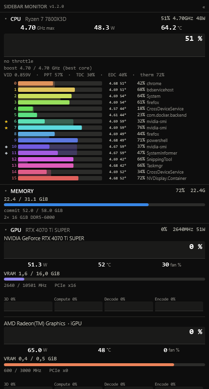
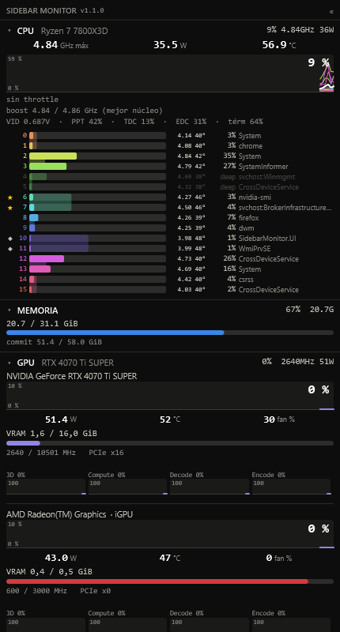
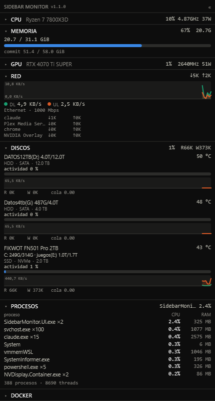

<div align="center">

# SidebarMonitor

**A native, always-on system monitor sidebar for Windows 11 — built for Ryzen + NVIDIA, and still working with Memory Integrity (HVCI) enabled.**

*CPU · per-core · GPU · memory · network · disks · processes — one lean panel on your second screen.*



</div>

---

## Why this exists

In 2025, Windows added the WinRing0 kernel driver to its [vulnerable-driver blocklist](https://it.slashdot.org/story/25/03/14/1351225/windows-defender-now-flags-winring0-driver-as-security-threat-breaking-multiple-pc-monitoring-tools). Overnight, most hardware monitors that read sensors through it — including [Sidebar Diagnostics](https://github.com/ArcadeRenegade/SidebarDiagnostics/issues/475) — stopped working on machines with **Memory Integrity / Core Isolation (HVCI)** turned on. The driver won't even load.

**SidebarMonitor takes a different route by design.** It ships **no kernel driver of its own** and never touches WinRing0. Instead it reads sensors through paths that are signed and HVCI-safe:

- **AMD Ryzen Master Monitoring SDK** — CPU temperature, package power, per-core clocks/temps (signed AMD driver, HVCI-safe)
- **NVML** and **ADLX** — NVIDIA and AMD GPU telemetry, both shipped with the vendor's own driver
- **Native Windows APIs** — PDH performance counters, D3DKMT, storage IOCTLs, ETW

The result is a monitor that keeps running exactly where the WinRing0 generation broke — no HWiNFO in the background, no dubious drivers.

## Highlights

- 🧊 **Runs with HVCI/VBS enabled** — the whole reason it exists.
- ⚡ **Tiny and fast** — the sampling agent is a **NativeAOT** binary (~2 MB, ~60 ms cold start, allocation-free hot path).
- 🔴 **Deep Ryzen telemetry** — per-core frequency, temperature and **C0/sleep** residency; best-core ★ / second-core ◆; power caps (PPT/TDC/EDC); throttle state; VID.
- 🎮 **Full GPU detail, dual-vendor** — NVIDIA via NVML and **AMD (Radeon dGPU / Ryzen iGPU) via ADLX**, plus per-engine activity (3D/compute/decode/encode) for *any* GPU via D3DKMT.
- 🌐 **Per-process network** and 💽 **per-disk temperature** (NVMe + SATA), SSD/HDD, activity graphs.
- 🧠 **RAM modules** (model / DDR generation / speed) read from SMBIOS, no elevation.
- 🐳 Optional **Docker** and **WSL** breakdowns.
- 🎛️ **Real settings window** + collapsible, reorderable sections, per-section refresh, colour presets, CSV logging.
- 🔒 **No telemetry.** Everything stays on your machine.

## Screenshots

| Full panel — CPU · Memory · GPU | Network · Disks · Processes |
|---|---|
|  |  |

The CPU section shows per-core bars coloured by the dominant process (with `svchost` broken out by service), per-core clock/temperature, the best-boosting cores marked ★/◆, and the current power/thermal limits. The GPU section shows the NVIDIA card in full and the Ryzen iGPU with real ADLX sensors.

## Requirements

- **Windows 11 x64** (developed and verified on 25H2, build 26200).
- **.NET 10 desktop runtime** for the UI (the sampling agent is self-contained).

Everything renders on any machine, but the **richest data depends on your hardware** — and the app degrades gracefully when a source is missing:

| Feature | Needs | Without it |
|---|---|---|
| CPU temp / power / per-core temp / throttle | **AMD Ryzen** + Ryzen Master Monitoring SDK (accepted at first run) | Those fields show `—`; everything else works. Intel is detected and the app explains why (ring0 needed). |
| NVIDIA GPU temp/power/fan/VRAM | NVIDIA driver (NVML) | GPU still shows per-engine activity via D3DKMT. |
| AMD GPU temp/power/fan/clocks/VRAM | AMD Adrenalin driver (ADLX) | GPU still shows per-engine activity via D3DKMT. |
| Per-core process colours, per-process network | The elevated helper (`SidebarMonitor.Etw`) | Bars still show usage; no per-process attribution. |

> **Best experience: a Ryzen CPU with an NVIDIA or AMD GPU.** That is what it was built and tuned on.

## Install

```powershell
# From a checkout or a release download:
./install.ps1        # self-elevates, installs to %LOCALAPPDATA%\SidebarMonitor\app
```

The installer publishes the three executables, registers the elevated helper as a **scheduled task** (runs at logon, no UAC prompt, hidden console) and the UI under the `HKCU\...\Run` key. On first launch you'll be shown the **AMD SDK licence** (only on AMD systems) and asked to accept it before CPU sensors are enabled.

To remove everything:

```powershell
./uninstall.ps1 -Purge   # -Purge also deletes the saved config
```

*(A `winget` manifest and an optional Microsoft Store listing are planned.)*

## How it works

Three cooperating processes, each chosen for a reason:

- **`SidebarMonitor.Agent`** — the sampler. **NativeAOT**, unelevated. Reads PDH, native APIs, NVMe temperature, NVML and ADLX, and publishes a fixed-layout `Snapshot` into shared memory via a lock-free **seqlock** (readers never block the writer).
- **`SidebarMonitor.Etw`** — an optional **elevated helper**. Runs a kernel ETW session (per-core process attribution, per-process network bytes) and the AMD Ryzen Master SDK (CPU temp/power via `RyzenShim.dll`). Publishes its own shared-memory channel; the agent merges it when present.
- **`SidebarMonitor.UI`** — the WPF panel. AppBar-docked or floating, resizable, click-through, tray icon. Config persisted to `%LOCALAPPDATA%\SidebarMonitor\ui.json`.

WPF can't be AOT-compiled and the helper needs a different elevation manifest, so keeping them as separate processes is deliberate — the agent stays native and unelevated. The full design, measurements and every trap found along the way are in **[docs/ARCHITECTURE.md](docs/ARCHITECTURE.md)**.

## FAQ

**Does it really work with Memory Integrity / Core Isolation on?**
Yes — that's the entire point. It ships no vulnerable driver and never uses WinRing0.

**Why does it need the AMD SDK?**
To read CPU temperature and power *without* a ring0 driver of our own. The AMD Ryzen Master Monitoring SDK provides a **signed, HVCI-safe** driver for exactly this. Its EULA is shown and must be accepted on first run; the AMD binaries are never committed to this repo — they're pulled at packaging time and travel only in the installer.

**Why an elevated helper?**
A kernel ETW session and the AMD SDK both require elevation. Isolating them in a small helper lets the main agent stay unelevated and AOT.

**Do you collect any telemetry?**
No. Nothing leaves your machine — no analytics, no crash reporting, no network activity at all during normal use. See [PRIVACY.md](PRIVACY.md).

**What about Intel CPUs?**
Intel CPU temperature/power needs a ring0 MSR path (e.g. PawnIO) that isn't bundled. The app detects Intel, tells you why those fields are blank, and everything else (GPU, memory, network, disks, processes) works normally.

**More questions?** See the full [FAQ](docs/FAQ.md).

## Building from source

You need the **.NET 10 SDK**, the **MSVC C++ toolchain** (for the native shims), and `vswhere.exe` on `PATH` (the AOT compiler and the shim builds call it — if it's missing you'll get a cryptic `MSB3073`):

```powershell
$env:PATH = "${env:ProgramFiles(x86)}\Microsoft Visual Studio\Installer;$env:PATH"

# Vendor SDKs (proprietary — pulled on demand, never committed):
native/RyzenSdk/fetch.ps1     # AMD Ryzen Master SDK DLLs (needs the SDK installed)
native/AdlxSdk/fetch.ps1      # ADLX SDK headers (cloned from AMD's GitHub)

# Native bridges (MSVC):
native/RyzenShim/build.cmd    # -> RyzenShim.dll  (CPU SDK bridge)
native/AdlxShim/build.cmd     # -> AdlxShim.dll   (GPU ADLX bridge)

# The apps:
dotnet build SidebarMonitor.slnx -c Release
```

## Licence

SidebarMonitor's own code is **[MIT](LICENSE)** © 2026 Rubén Arbós. It builds on third-party components (AMD Ryzen Master SDK, ADLX, NVML, TraceEvent, the VC++ runtime and .NET), each under its own terms — see **[THIRD-PARTY-NOTICES.md](THIRD-PARTY-NOTICES.md)**. AMD's proprietary binaries and SDK headers are never redistributed in this repository.
